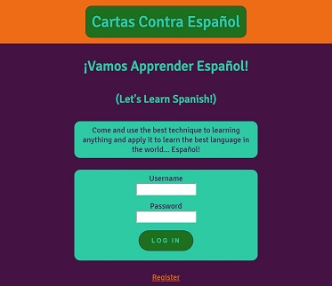
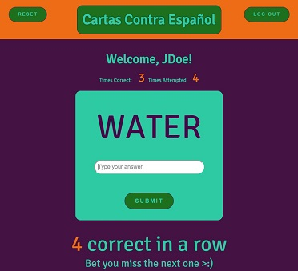
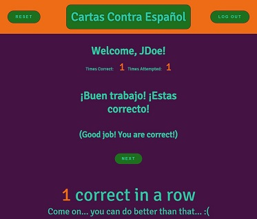
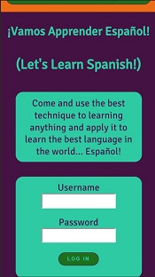
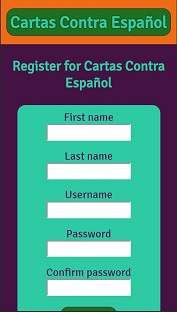
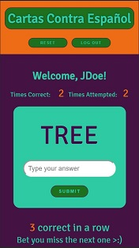
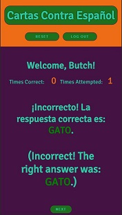

# Welcome to Cartas Contra Español!

Cartas Contra Español is a language learning app that uses spaced repetition.  If the user translates the word correctly it will be pushed further down the list.  If they get the translation wrong, they will see the word more often until they answer it correctly. 

__________________________
## Below are links to the live app and GitHub Repo for the server side:
- [Live App](https://sr-app-sj.herokuapp.com/dashboard)
- [Server Repo](https://github.com/thinkful-ei21/spaced-rep-server-sonya-jonathan)

__________________________
## Screenshots of the Game

### Desktop View

##### Landing Page

##### Registration Page

##### Game Screen

##### Feedback Screen

### Mobile View

##### Landing Page  #############  Registration Page  ###############   Game Screen   ################   Feedback Screen
         

__________________________
## Tech Stack

### Cartas Contra Español is built using the following:
 
* HTML5
* Cascading Style Sheet/Flex Box
* JavaScript
* NodeJS
* MongoDB

### Client-Side

* React
* React Redux
* Redux Thunk
* JWT-Decode

### Server-Side

* Express
* Mongoose
* Morgan
* Passport
* JSONWedToken
* Bcryptjs
__________________________
## Project's Key Parts Locations

### Client-Side
* Actions
* Components 
* Local Storage
* Reducers
* Store
* Styles
* Tests
* Validators

### Server-Side
* Models
* Passport
* Routes
* Tests
* Server - (index.js)

## Dev Setup:

* Clone both reops (this one and the [Server Repo](https://github.com/thinkful-ei21/spaced-rep-server-sonya-jonathan))

* Once you have them cloned run `npm install` on both in order to get all dependancies.

